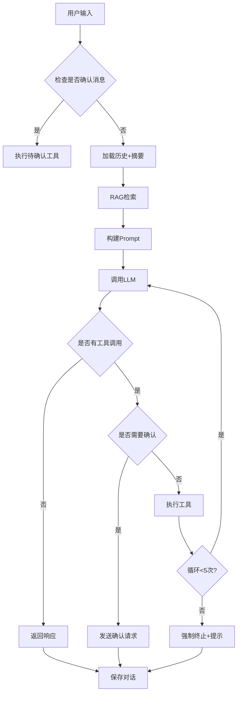

# Agent 架构与实现指南

> **企业级 AI Agent 系统**，基于 OpenRouter + ToolRegistry + RAG + Memory 构建

## 📚 目录

1. [系统架构](#1-系统架构)
2. [核心模块](#2-核心模块)
3. [Agent 工作流程](#3-agent-工作流程)
4. [工具系统](#4-工具系统)
5. [RAG 知识库](#5-rag-知识库)
6. [记忆管理](#6-记忆管理)
7. [扩展开发](#7-扩展开发)
8. [最佳实践](#8-最佳实践)

---

## 1. 系统架构

### 1.1 整体架构图

```
┌─────────────────────────────────────────────────────────┐
│                    Agent 系统                            │
├─────────────────────────────────────────────────────────┤
│  用户输入                                                │
│     ↓                                                    │
│  ┌──────────────────────────────────────┐               │
│  │ Agent Core (agent.ts)                │               │
│  │ - 对话管理                            │               │
│  │ - 工具调用循环                         │               │
│  │ - SSE 流式响应                         │               │
│  └──────────┬───────────────────────────┘               │
│             │                                            │
│    ┌────────┼────────┬──────────┐                       │
│    ↓        ↓        ↓          ↓                       │
│  ┌────┐  ┌────┐  ┌─────┐   ┌──────┐                    │
│  │Tool│  │RAG │  │Memory│  │Prompt│                    │
│  │注册│  │检索│  │ 摘要 │  │ 构建 │                    │
│  └────┘  └────┘  └─────┘   └──────┘                    │
│    ↓        ↓        ↓          ↓                       │
│  ┌─────────────────────────────────┐                    │
│  │  LLM (OpenRouter)               │                    │
│  └─────────────────────────────────┘                    │
│                 ↓                                        │
│           工具执行 + 结果返回                             │
└─────────────────────────────────────────────────────────┘
```

### 1.2 文件结构

```
src/lib/agent/
├── agent.ts              # ⭐ Agent 核心流程
├── config.ts             # 配置管理
├── core.ts               # 核心组件 (OpenAI, Redis, Schema)
├── utils.ts              # 工具函数 (Logger, ID, Constants)
├── types.ts              # 类型定义
├── mcp.ts                # 工具注册和调用
├── tool-registry.ts      # 工具注册表
├── tool-validator.ts     # 工具验证
├── tool-extensions.example.ts  # 扩展示例
├── rag.ts                # RAG 检索
├── memory.ts             # 记忆管理
├── prompt.ts             # Prompt 构建
├── sse.ts                # SSE 流式响应
└── index.ts              # 导出汇总
```

**优化说明**：
- ✅ 合并了 `crypto.ts` + `logger.ts` + `constants.ts` → `utils.ts`
- ✅ 合并了 `openai.ts` + `redis.ts` + `schema.ts` → `core.ts`
- ✅ 从 18 个文件精简到 12 个文件
- ✅ 职责更清晰，减少循环依赖

---

## 2. 核心模块

### 2.1 agent.ts - Agent 核心

**职责**: 管理对话流程、工具调用循环、错误处理

**关键函数**:

```typescript
// 主入口：流式响应
export const streamAgentResponse = async (input: AgentInput)

// 构建消息上下文
const buildMessages = async ({ conversationId, userMessage, topK })

// 工具调用循环（优化版）
const streamCompletion = async ({ controller, messages, conversationId, userMessage })
```

**工作流程**:
1. 接收用户输入
2. 加载对话历史 + 摘要
3. RAG 检索相关文档
4. 构建系统 Prompt
5. 调用 LLM 生成响应
6. 处理工具调用（最多 5 轮循环）
7. 返回结果并保存对话

**优化点**:
- ✅ 改进循环控制逻辑，避免 `shouldContinue` 标志位混乱
- ✅ 增加最大循环警告，防止无限循环
- ✅ 使用 `logger` 替换 `console.log`

---

### 2.2 tool-registry.ts - 工具注册表

**职责**: 统一管理所有工具，支持动态注册和验证

**核心类**:

```typescript
class ToolRegistry {
  // 注册工具
  register(metadata: ToolMetadata): void
  
  // 执行工具
  async execute(name: string, args: unknown): Promise<unknown>
  
  // 转换为 OpenAI 格式
  toOpenAITools(): OpenAITool[]
  
  // 获取工具信息
  getTool(name: string): ToolMetadata | undefined
  listToolNames(): string[]
  requiresConfirmation(name: string): boolean
}
```

**内置工具** (在 `mcp.ts` 中注册):
- `ping` - 测试连接
- `get_current_time` - 获取当前时间
- `search_docs` - 搜索知识库
- `calculate` - 数学计算
- `delete_file` - 删除文件（需确认）

---

### 2.3 rag.ts - RAG 检索

**职责**: 文档上传、Embedding、语义检索

**核心函数**:

```typescript
// 上传文档
export const upsertDocument = async ({
  sourceId, title, content, metadata
}): Promise<{ chunkCount, chunkIds }>

// 语义检索
export const search = async ({
  query, topK, scoreThreshold
}): Promise<RagChunk[]>

// 删除文档
export const removeBySource = async (sourceId: string)
```

**优化特性**:
- ✅ **两层缓存**: Redis (1小时) + 内存 (可配置)
- ✅ **提前过滤**: 在排序前过滤低分文档，减少计算量
- ✅ **性能日志**: 记录检索耗时和命中率

---

### 2.4 memory.ts - 记忆管理

**职责**: 对话历史管理、智能摘要

**核心函数**:

```typescript
// 获取历史消息
export const getMessages = async (conversationId: string)

// 获取摘要（合并历史摘要）
export const getSummary = async (conversationId: string)

// 添加消息并自动摘要
export const appendAndMaybeSummarize = async (
  conversationId: string,
  message: CompletionMessage
)
```

**优化特性**:
- ✅ **Token 感知**: 基于 token 数量触发摘要，而非固定消息数
- ✅ **增量摘要**: 保留历史摘要上下文，避免信息丢失
- ✅ **保留最近消息**: 摘要后保留最近 N 条消息（可配置）

---

## 3. Agent 工作流程

### 3.1 单次对话流程



### 3.2 工具调用循环

**优化前**:
```typescript
while (shouldContinue && loopCount < 5) {
  loopCount++
  shouldContinue = false
  // ... 工具调用
  shouldContinue = true  // 混乱的标志位
}
```

**优化后**:
```typescript
const maxLoops = 5
while (loopCount < maxLoops) {
  loopCount++
  const isLastLoop = loopCount >= maxLoops
  
  // ... LLM 调用
  
  // 无工具调用，直接退出
  if (toolCalls.size === 0) return
  
  // 处理工具调用
  let needsContinue = false
  for (const call of toolCallArray) {
    // ...
    needsContinue = true
  }
  
  // 达到最大循环，强制终止
  if (isLastLoop && needsContinue) {
    logger.warn('达到最大循环次数')
    return
  }
  
  // 不需要继续，退出
  if (!needsContinue) return
}
```

---

## 4. 工具系统

### 4.1 工具定义

使用 Zod 定义工具参数：

```typescript
import { z } from 'zod'
import { toolRegistry } from './tool-registry'

toolRegistry.register({
  name: 'search_docs',
  description: '在知识库中进行语义检索',
  category: 'knowledge',
  requiresConfirmation: false,
  parameters: z.object({
    query: z.string().describe('搜索查询文本'),
    topK: z.number().int().positive().optional().describe('返回结果数量'),
  }),
  execute: async ({ query, topK }) => {
    const results = await ragSearch({ query, topK })
    return { success: true, data: results }
  },
})
```

### 4.2 扩展自定义工具

参考 `tool-extensions.example.ts`:

```typescript
// 1. 天气查询工具
toolRegistry.register({
  name: 'get_weather',
  description: '获取指定城市的天气信息',
  category: 'external',
  parameters: z.object({
    city: z.string().describe('城市名称，如"北京"、"上海"'),
  }),
  execute: async ({ city }) => {
    // 调用天气 API
    const weather = await weatherApi.get(city)
    return { success: true, data: weather }
  },
})

// 2. 数据库查询工具
toolRegistry.register({
  name: 'query_database',
  description: '执行 SQL 查询',
  category: 'dangerous',
  requiresConfirmation: true,
  parameters: z.object({
    sql: z.string().describe('SQL 查询语句'),
  }),
  execute: async ({ sql }) => {
    const result = await db.query(sql)
    return { success: true, data: result }
  },
})
```

### 4.3 工具分类

| 分类 | 说明 | 示例 |
|------|------|------|
| `system` | 系统工具 | ping, get_current_time |
| `knowledge` | 知识库工具 | search_docs |
| `external` | 外部 API | get_weather |
| `dangerous` | 危险操作 | delete_file, query_database |

---

## 5. RAG 知识库

### 5.1 上传文档

```typescript
import { upsertDocument } from '@/lib/agent'

await upsertDocument({
  sourceId: 'doc-001',
  title: '产品手册',
  content: '这是产品的详细说明...',
  metadata: { author: 'admin', version: 'v1.0' },
})
```

### 5.2 检索文档

```typescript
import { search } from '@/lib/agent'

const chunks = await search({
  query: '如何重置密码',
  topK: 5,
  scoreThreshold: 0.3,
})

chunks.forEach(chunk => {
  console.log(`相关度: ${chunk.score}`)
  console.log(chunk.content)
})
```

### 5.3 性能优化

**Embedding 缓存**:
```typescript
// Redis 缓存 (1 小时)
const cacheKey = `kb:emb-cache:${hashText(text)}`
const cached = await redis.get(cacheKey)
if (cached) return JSON.parse(cached)

// 生成 embedding
const embedding = await openaiClient.embeddings.generate(...)
await redis.setex(cacheKey, 3600, JSON.stringify(embedding))
```

**内存缓存**:
```typescript
let chunksCache: RagChunk[] | null = null
let chunksCacheTimestamp = 0

const listChunks = async () => {
  const now = Date.now()
  if (chunksCache && now - chunksCacheTimestamp < cacheTTL) {
    return chunksCache  // 命中缓存
  }
  // 从 Redis 加载
  chunksCache = await loadFromRedis()
  chunksCacheTimestamp = now
  return chunksCache
}
```

---

## 6. 记忆管理

### 6.1 Token 感知摘要

```typescript
// 估算 token 数量
const estimateTokens = (message: CompletionMessage): number => {
  const content = message.content || ''
  const chineseChars = (content.match(/[\u4e00-\u9fa5]/g) || []).length
  const englishWords = content.split(/\s+/).length
  return Math.ceil(chineseChars * 1.5 + englishWords * 1.3)
}

// 判断是否需要摘要
const shouldSummarize = (messages: CompletionMessage[]) => {
  const totalTokens = getTotalTokens(messages)
  return totalTokens > config.memorySummaryMaxTokens  // 默认 3000
}
```

### 6.2 增量摘要

```typescript
// 摘要时保留历史
if (oldSummary) {
  await redis.rpush(summaryHistoryKey(conversationId), oldSummary)
  await redis.ltrim(summaryHistoryKey(conversationId), -3, -1)  // 保留最近 3 个
}

// 获取摘要时合并历史
export const getSummary = async (conversationId: string) => {
  const currentSummary = await redis.get(summaryKey(conversationId))
  const history = await redis.lrange(summaryHistoryKey(conversationId), 0, -1)
  
  if (history.length === 0) return currentSummary
  
  return `【历史摘要】\n${history.join('\n\n')}\n\n【最近摘要】\n${currentSummary}`
}
```

---

## 7. 扩展开发

### 7.1 添加新工具

1. 在 `mcp.ts` 或独立文件中注册：

```typescript
import { toolRegistry } from './tool-registry'
import { z } from 'zod'

toolRegistry.register({
  name: 'send_email',
  description: '发送邮件',
  category: 'external',
  parameters: z.object({
    to: z.string().email().describe('收件人邮箱'),
    subject: z.string().describe('邮件主题'),
    body: z.string().describe('邮件正文'),
  }),
  execute: async ({ to, subject, body }) => {
    await emailService.send(to, subject, body)
    return { success: true, messageId: 'msg-123' }
  },
})
```

2. 工具会自动出现在 Prompt 中，LLM 可直接调用

### 7.2 集成外部 MCP Server

```typescript
// tool-extensions.ts
import { Client } from '@modelcontextprotocol/sdk/client/index.js'

const mcpClient = new Client({
  name: 'my-app',
  version: '1.0.0',
})

await mcpClient.connect(transport)

// 包装 MCP 工具
const mcpTools = await mcpClient.listTools()
mcpTools.tools.forEach(tool => {
  toolRegistry.register({
    name: `mcp_${tool.name}`,
    description: tool.description,
    category: 'external',
    parameters: z.object(tool.inputSchema.properties),
    execute: async (args) => {
      return await mcpClient.callTool({ name: tool.name, arguments: args })
    },
  })
})
```

---

## 8. 最佳实践

### 8.1 Prompt 设计

```typescript
// ❌ 不好的 Prompt
const badPrompt = '你是一个助手'

// ✅ 好的 Prompt
const goodPrompt = `你是企业级AI助手。

## 工作原则
1. 必要时调用工具，不要编造事实
2. 优先使用知识库中的信息
3. 不确定时明确告知用户

## 输出格式
- 使用中文
- 结构化输出
- 引用来源`
```

### 8.2 工具设计原则

1. **单一职责**: 一个工具只做一件事
2. **清晰描述**: LLM 能理解何时使用
3. **参数验证**: 使用 Zod Schema
4. **错误处理**: 返回结构化错误

```typescript
// ✅ 好的工具设计
toolRegistry.register({
  name: 'get_user_info',  // 清晰的名称
  description: '根据用户ID获取用户基本信息（姓名、邮箱、角色）',  // 详细描述
  category: 'system',
  parameters: z.object({
    userId: z.string().describe('用户唯一标识符'),
  }),
  execute: async ({ userId }) => {
    try {
      const user = await userService.getById(userId)
      if (!user) {
        return { success: false, message: '用户不存在' }
      }
      return { success: true, data: { name: user.name, email: user.email } }
    } catch (error) {
      return { success: false, message: error.message }
    }
  },
})
```

### 8.3 性能优化

1. **缓存策略**
   - Embedding 缓存：1 小时
   - 文档列表缓存：60 秒（可配置）
   
2. **并发控制**
   - 工具调用串行执行（避免冲突）
   - RAG 检索并行（多查询）

3. **资源限制**
   - 最大循环次数：5 次
   - 上下文窗口：3000 tokens 触发摘要
   - 保留消息数：最近 5 条

### 8.4 监控和日志

```typescript
// 使用结构化日志
logger.info('RAG 检索完成', {
  query: query.slice(0, 50),
  totalChunks: chunks.length,
  matchedCount: scored.length,
  topScore: scored[0]?.score,
})

logger.warn('达到最大循环次数', { loopCount })

logger.error('工具执行失败', { toolName, error: error.message })
```

---

## 配置参考

所有配置项在 `.env` 中：

```bash
# OpenRouter 配置
OPENROUTER_API_KEY=your_api_key
OPENROUTER_BASE_URL=https://openrouter.ai/api/v1
LLM_MODEL=gpt-4o-mini
EMBEDDING_MODEL=text-embedding-3-small

# RAG 配置
RAG_ENABLED=true
RAG_TOP_K=4
RAG_SCORE_THRESHOLD=0.1
RAG_CACHE_TTL_MS=60000

# Memory 配置
MEMORY_MAX_MESSAGES=30
MEMORY_SUMMARY_EVERY=12
MEMORY_SUMMARY_MAX_TOKENS=3000
MEMORY_KEEP_RECENT_COUNT=5

# MCP 配置
MCP_CONFIRM_REQUIRED=true

# SSE 配置
SSE_HEARTBEAT_MS=15000
```

---

## API 使用示例

```bash
# 发送对话
curl -X POST http://localhost:3008/api/ai/agent/chat \
  -H "Content-Type: application/json" \
  -d '{
    "conversation_id": "test-session",
    "message": "搜索关于密码重置的文档",
    "top_k": 5
  }'

# 列出可用工具
curl http://localhost:3008/api/ai/agent/tools

# 上传文档
curl -X POST http://localhost:3008/api/ai/knowledge/upload \
  -H "Content-Type: application/json" \
  -d '{
    "sourceId": "doc-001",
    "title": "产品手册",
    "content": "..."
  }'
```

---

## 推荐资源

- [OpenRouter 文档](https://openrouter.ai/docs)
- [MCP Protocol](https://modelcontextprotocol.io)
- [Zod 文档](https://zod.dev)
- [LangChain Agents](https://python.langchain.com/docs/modules/agents/)

---

**最后更新**: 2026-02-03

---

## 1. Agent 基础概念

### 什么是 Agent?

Agent 是一个能够**自主决策**和**执行任务**的 AI 系统。与简单的 LLM 调用不同，Agent 具有：

```
┌─────────────────────────────────────────────────────┐
│                     Agent                            │
│  ┌─────────┐   ┌─────────┐   ┌─────────┐           │
│  │ 感知    │ → │ 推理    │ → │ 行动    │           │
│  │ Perceive│   │ Reason  │   │ Act     │           │
│  └─────────┘   └─────────┘   └─────────┘           │
│       ↑                           │                 │
│       └───────── 反馈 ────────────┘                 │
└─────────────────────────────────────────────────────┘
```

### 核心组件

| 组件 | 作用 | 实现 |
|------|------|------|
| **LLM** | 大脑，负责推理 | OpenAI/Claude/本地模型 |
| **Memory** | 记忆，存储上下文 | Redis/向量数据库 |
| **Tools** | 能力，执行动作 | 函数调用 |
| **Planner** | 计划，分解任务 | LLM + Prompt |

---

## 2. Agent 类型详解

### 2.1 ReAct Agent (推理-行动)

**原理**: 交替进行思考(Thought)和行动(Action)，观察(Observation)结果后继续循环。

```
循环:
  Thought: 我需要查询天气
     ↓
  Action: get_weather(city="北京")
     ↓
  Observation: {temperature: 25, condition: "晴"}
     ↓
  Thought: 我已经得到了答案
     ↓
  Final Answer: 北京今天25度，晴天
```

**代码示例**:

```typescript
import { ReActAgent, commonTools } from '@/lib/ai/agent-framework'

const agent = new ReActAgent({
  name: 'weather-assistant',
  tools: commonTools,
  systemPrompt: '你是一个天气助手',
  maxSteps: 10
})

const result = await agent.run('北京今天天气怎么样?', 'session-123')
console.log(result.output)  // 北京今天25度，晴天
console.log(result.steps)   // 执行步骤详情
```

**API 调用**:

```bash
curl -X POST http://localhost:3008/api/ai/agent \
  -H "Content-Type: application/json" \
  -d '{
    "action": "run-react",
    "data": {
      "input": "北京今天天气怎么样?",
      "sessionId": "test-session"
    }
  }'
```

**适用场景**: 简单任务、问答、信息查询

---

### 2.2 Plan-and-Execute Agent (计划-执行)

**原理**: 先制定完整计划，再逐步执行。支持失败重规划。

```
1. Planning Phase (规划阶段)
   输入: "帮我分析这家公司的股票"
      ↓
   计划:
   - Task 1: 搜索公司基本信息
   - Task 2: 获取财务数据
   - Task 3: 分析技术指标
   - Task 4: 综合评估

2. Execution Phase (执行阶段)
   Task 1 → Result 1
   Task 2 → Result 2 (失败) → Replan
   Task 3 → Result 3
   Task 4 → Final Result
```

**代码示例**:

```typescript
import { PlanExecuteAgent, commonTools } from '@/lib/ai/agent-framework'

const agent = new PlanExecuteAgent({
  name: 'analyst',
  tools: commonTools,
  systemPrompt: '你是一个数据分析专家'
})

const result = await agent.run(
  '分析最近一周的销售数据，找出增长最快的产品',
  'session-456'
)
```

**API 调用**:

```bash
curl -X POST http://localhost:3008/api/ai/agent \
  -H "Content-Type: application/json" \
  -d '{
    "action": "run-plan-execute",
    "data": {
      "input": "分析最近一周的销售数据",
      "sessionId": "test-session"
    }
  }'
```

**适用场景**: 复杂任务、多步骤分析、需要回滚的场景

---

### 2.3 Supervisor Agent (多 Agent 协调)

**原理**: 管理多个子 Agent，根据任务类型分配给合适的 Agent。

```
                    ┌─────────────┐
                    │  Supervisor │
                    └──────┬──────┘
              分配任务      │
         ┌─────────┬───────┼───────┬─────────┐
         ↓         ↓       ↓       ↓         ↓
    ┌────────┐ ┌────────┐ ┌────────┐ ┌────────┐
    │Research│ │ Coder  │ │Writer  │ │Analyst │
    │ Agent  │ │ Agent  │ │ Agent  │ │ Agent  │
    └────────┘ └────────┘ └────────┘ └────────┘
```

**代码示例**:

```typescript
import {
  SupervisorAgent,
  createReActAgent,
  createPlanExecuteAgent
} from '@/lib/ai/agent-framework'

// 创建子 Agent
const researchAgent = createReActAgent('researcher', [...])
const coderAgent = createReActAgent('coder', [...])
const writerAgent = createReActAgent('writer', [...])

// 创建 Supervisor
const supervisor = new SupervisorAgent({
  name: 'supervisor',
  subAgents: [researchAgent, coderAgent, writerAgent]
})

const result = await supervisor.run(
  '帮我写一篇关于 AI 的技术博客',
  'session-789'
)
// Supervisor 会自动选择 researcher 收集资料，然后 writer 写作
```

**适用场景**: 复杂项目、需要多种专业能力、团队协作

---

## 3. 工具系统

### 3.1 工具定义

```typescript
interface Tool {
  name: string           // 工具名称
  description: string    // 描述（给 LLM 看）
  parameters: {          // 参数 Schema
    type: 'object'
    properties: Record<string, {
      type: string
      description: string
      enum?: string[]
    }>
    required?: string[]
  }
  execute: (params: any, context: AgentContext) => Promise<any>
}
```

### 3.2 内置工具

| 工具名 | 功能 | 参数 |
|--------|------|------|
| `web_search` | 网络搜索 | query, limit |
| `get_weather` | 天气查询 | city |
| `calculator` | 数学计算 | expression |
| `code_interpreter` | 代码执行 | language, code |
| `read_file` | 读文件 | path |
| `write_file` | 写文件 | path, content |
| `http_request` | HTTP 请求 | method, url, body |
| `database_query` | 数据库查询 | query |

### 3.3 自定义工具

```typescript
const myTool: Tool = {
  name: 'send_email',
  description: '发送邮件',
  parameters: {
    type: 'object',
    properties: {
      to: { type: 'string', description: '收件人' },
      subject: { type: 'string', description: '主题' },
      body: { type: 'string', description: '内容' }
    },
    required: ['to', 'subject', 'body']
  },
  execute: async (params, context) => {
    // 调用邮件 API
    await emailService.send(params.to, params.subject, params.body)
    return { success: true, messageId: '...' }
  }
}

// 使用自定义工具
const agent = new ReActAgent({
  name: 'email-agent',
  tools: [...commonTools, myTool]
})
```

---

## 4. Agent 编排

### 4.1 顺序执行

```typescript
// Agent A 的输出作为 Agent B 的输入
const results = await agentOrchestrator.runSequential(
  ['researcher', 'writer'],
  '写一篇关于 AI 的文章',
  sessionId
)
```

### 4.2 并行执行

```typescript
// 同时运行多个 Agent
const results = await agentOrchestrator.runParallel(
  ['factChecker', 'styleChecker', 'grammarChecker'],
  '检查这篇文章',
  sessionId
)
```

### 4.3 条件执行

```typescript
// 根据输入选择不同的 Agent
const result = await agentOrchestrator.runConditional(
  userInput,
  sessionId,
  (input) => {
    if (input.includes('代码')) return 'coder'
    if (input.includes('写作')) return 'writer'
    return 'general'
  }
)
```

### 4.4 管道执行

```typescript
// 带数据转换的管道
const result = await agentOrchestrator.runPipeline(
  [
    { agent: 'researcher' },
    {
      agent: 'analyzer',
      transform: (result) => `分析以下数据: ${result}`
    },
    { agent: 'reporter' }
  ],
  '调研 AI 市场',
  sessionId
)
```

---

## 5. 状态管理

### 5.1 Agent 生命周期

```
idle → thinking → acting → waiting → completed
                    ↓
                  failed
```

### 5.2 状态持久化

```typescript
// 保存状态
await agent.saveState(sessionId)

// 恢复状态
await agent.loadState(sessionId)

// 状态存储在 Redis:
// agent:history:{sessionId} - 对话历史
// agent:state:{sessionId}   - 执行状态
// agent:steps:{sessionId}   - 步骤记录
```

### 5.3 监听事件

```typescript
agent.on('start', ({ input, context }) => {
  console.log('Agent started:', input)
})

agent.on('thought', (step) => {
  console.log('Thinking:', step.content)
})

agent.on('toolCall', ({ tool, params }) => {
  console.log('Calling tool:', tool, params)
})

agent.on('toolResult', ({ tool, result }) => {
  console.log('Tool result:', result)
})

agent.on('complete', (result) => {
  console.log('Completed:', result.output)
})

agent.on('error', (error) => {
  console.error('Error:', error)
})
```

---

## 6. 实战示例

### 6.1 智能客服 Agent

```typescript
const customerServiceAgent = new ReActAgent({
  name: 'customer-service',
  tools: [
    {
      name: 'query_order',
      description: '查询订单状态',
      parameters: { ... },
      execute: async (params) => {
        return await orderService.getOrder(params.orderId)
      }
    },
    {
      name: 'create_ticket',
      description: '创建工单',
      parameters: { ... },
      execute: async (params) => {
        return await ticketService.create(params)
      }
    }
  ],
  systemPrompt: `你是一个专业的客服代表。
    - 始终保持礼貌和耐心
    - 先查询相关信息再回答
    - 如果无法解决，创建工单升级`
})
```

### 6.2 代码助手 Agent

```typescript
const codeAssistantAgent = new PlanExecuteAgent({
  name: 'code-assistant',
  tools: [
    {
      name: 'read_codebase',
      description: '读取代码库',
      execute: async (params) => { ... }
    },
    {
      name: 'write_code',
      description: '写代码',
      execute: async (params) => { ... }
    },
    {
      name: 'run_tests',
      description: '运行测试',
      execute: async (params) => { ... }
    }
  ],
  systemPrompt: `你是一个代码助手。
    1. 先理解需求
    2. 阅读相关代码
    3. 编写解决方案
    4. 运行测试验证`
})
```

### 6.3 研究助手 (Multi-Agent)

```typescript
// 研究员：收集信息
const researcher = createReActAgent('researcher', [webSearchTool])

// 分析师：分析数据
const analyst = createReActAgent('analyst', [dataTool])

// 写手：撰写报告
const writer = createReActAgent('writer', [writeTool])

// 协调员
const coordinator = new SupervisorAgent({
  name: 'research-coordinator',
  subAgents: [researcher, analyst, writer],
  systemPrompt: `协调研究流程:
    1. 让 researcher 收集资料
    2. 让 analyst 分析数据
    3. 让 writer 撰写报告`
})

const result = await coordinator.run(
  '研究电动汽车市场趋势',
  'research-session'
)
```

---

## 7. 最佳实践

### 7.1 Prompt 设计

```typescript
// ❌ 不好的 Prompt
const badPrompt = '你是一个助手'

// ✅ 好的 Prompt
const goodPrompt = `你是一个专业的数据分析师。

## 角色
- 擅长数据分析和可视化
- 精通 SQL 和 Python

## 工作流程
1. 理解用户需求
2. 查询相关数据
3. 进行分析
4. 给出结论和建议

## 限制
- 只回答数据相关问题
- 不确定时要说明
- 敏感数据需要脱敏

## 输出格式
使用 Markdown 格式，包含:
- 数据摘要
- 分析结论
- 建议措施`
```

### 7.2 工具设计

```typescript
// ❌ 工具太复杂
const badTool = {
  name: 'do_everything',
  description: '处理所有请求',
  // ...
}

// ✅ 工具单一职责
const goodTool = {
  name: 'get_user_orders',
  description: '根据用户ID获取订单列表',
  parameters: {
    type: 'object',
    properties: {
      userId: { type: 'string', description: '用户ID' },
      status: { type: 'string', enum: ['pending', 'shipped', 'completed'] },
      limit: { type: 'number', description: '返回数量，默认10' }
    },
    required: ['userId']
  }
}
```

### 7.3 错误处理

```typescript
const agent = new ReActAgent({
  name: 'robust-agent',
  hooks: {
    onError: async (error, context) => {
      // 记录错误
      await logService.error('Agent error', { error, context })

      // 发送告警
      if (error.message.includes('timeout')) {
        await alertService.send('Agent timeout')
      }
    },
    afterStep: async (step, context) => {
      // 监控步骤执行
      if (step.duration && step.duration > 5000) {
        console.warn('Step took too long:', step)
      }
    }
  }
})
```

### 7.4 性能优化

1. **设置合理的 maxSteps** - 防止无限循环
2. **使用缓存** - 对相同查询缓存结果
3. **工具超时** - 每个工具设置超时时间
4. **并行执行** - 独立任务并行处理
5. **流式输出** - 使用 `runStream()` 实时返回结果

---

## API 快速参考

```bash
# 列出可用 Agent
GET /api/ai/agent?action=list-agents

# 列出可用工具
GET /api/ai/agent?action=list-tools

# 运行 ReAct Agent
POST /api/ai/agent
{ "action": "run-react", "data": { "input": "..." } }

# 运行 Plan-Execute Agent
POST /api/ai/agent
{ "action": "run-plan-execute", "data": { "input": "..." } }

# 运行 Supervisor Agent
POST /api/ai/agent
{ "action": "run-supervisor", "data": { "input": "..." } }

# 顺序执行
POST /api/ai/agent
{ "action": "run-sequential", "data": { "agents": ["a", "b"], "input": "..." } }

# 并行执行
POST /api/ai/agent
{ "action": "run-parallel", "data": { "agents": ["a", "b"], "input": "..." } }
```

---

## 推荐资源

- [LangChain Agents](https://python.langchain.com/docs/modules/agents/)
- [AutoGPT](https://github.com/Significant-Gravitas/AutoGPT)
- [CrewAI](https://github.com/joaomdmoura/crewAI)
- [ReAct 论文](https://arxiv.org/abs/2210.03629)
